# プロジェクト クラス図

このドキュメントは、Unityプロジェクト「Ship」のクラス構造をMermaid形式で表現したクラス図です。

## 主要なシステム構成

### コアシステム
- **GameTime**: ゲーム内時間スケール管理
- **GameTimeBehaviour**: 時間スケール対応の基底クラス

### ユニットシステム
- **UnitCore**: ユニットの中核コンポーネント、他のコンポーネントへのアクセスポイント
- **CombatantStatus**: HP、気絶値、ステータス効果の管理
- **UnitTargeting**: ターゲット選択システム
- **WeaponController**: 射撃制御
- **UnitMotor**: 移動制御
- **UnitPathAgent**: A*パスファインディングを使用した経路探索

### マネージャークラス（シングルトン）
- **UnitDirectory**: 全ユニットの索引管理（陣営別、セル別）
- **MapManager**: タイルマップ管理、通行可否判定
- **LoSManager**: 視界（Line of Sight）判定
- **CombatResolver**: 戦闘解決（命中判定、ダメージ計算）

### データクラス（ScriptableObject）
- **WeaponStatsSO**: 武器ステータス
- **EquipmentSO**: 装備アイテム
- **UnitArchetypeSO**: ユニット種別
- **WeaponEffectsSO**: 武器効果設定

### ステータス効果システム
- **IStatusEffect**: ステータス効果のインターフェース
- **BleedEffect**: 出血効果の実装
- **HemorrhageEffect**: 失血効果の実装

### UI/入力システム
- **SelectionManager**: ユニット選択管理
- **CommandController**: 移動・攻撃命令処理
- **Selectable**: 選択可能なオブジェクトのマーカー

```mermaid
classDiagram
    %% 基底クラスとインターフェース
    class MonoBehaviour {
        <<abstract>>
    }
    
    class ScriptableObject {
        <<abstract>>
    }
    
    class GameTimeBehaviour {
        <<abstract>>
        +float dt
        +float udt
    }
    
    class IStatusEffect {
        <<interface>>
        +string Id
        +bool IsExpired
        +OnApply(CombatantStatus)
        +OnTick(CombatantStatus, float)
        +OnStack(IStatusEffect)
        +OnRemove(CombatantStatus)
    }

    %% 時間管理システム
    class GameTime {
        +static Instance
        +float timeScale
        +bool paused
        +static float Delta
        +static float Unscaled
        +SetSpeed(float)
        +Pause()
        +Slow()
        +Normal()
        +Fast()
    }
    
    %% ScriptableObject データクラス
    class WeaponStatsSO {
        +float fireRate
        +float rangeCells
        +float baseAccuracy
        +int damageMin
        +int damageMax
        +float critChance
        +float critMultiplier
    }
    
    class EquipmentSO {
        +string equipmentName
        +int hpBonus
        +int damageBonus
        +float fireRateBonus
        +GameObject overrideVisualPrefab
    }
    
    class UnitArchetypeSO {
        +string displayName
        +GameObject unitPrefab
        +int baseHP
        +int baseDamage
        +float baseFireRate
    }
    
    class WeaponEffectsSO {
        +List~EffectSpec~ onHitEffects
        EffectSpec
        +string id
        +float amount
        +float duration
        +float chance
    }
    
    %% データクラス
    class UnitLoadout {
        +string nickname
        +int factionId
        +UnitArchetypeSO archetype
        +EquipmentSO equipA
        +EquipmentSO equipB
        +int level
        +WeaponStatsSO weaponStats
        +WeaponEffectsSO onHitEffects
    }

    %% ユニットコアシステム
    class UnitCore {
        +int UnitId
        +FactionTag Faction
        +CombatantStatus Status
        +GridAgent Grid
        +UnitMotor Motor
        +UnitPathAgent Path
        +UnitPerception Perception
        +UnitTargeting Targeting
        +WeaponController Weapon
    }
    
    class FactionTag {
        +int FactionId
    }
    
    class GridAgent {
        +Vector3Int Cell
        +SnapToGrid()
        +TryReserve(Vector3Int)
    }
    
    class CombatantStatus {
        +int maxHP
        +int currentHP
        +float stunValue
        +bool isKO
        +bool isDead
        +float tickSec
        +bool autoDestroyOnDeath
        +float destroyDelay
        +IReadOnlyDictionary~string,IStatusEffect~ Effects
        +ApplyDamage(int)
        +AddStun(float)
        +AddOrStackEffect(IStatusEffect)
        +RemoveEffect(string)
        -RecalcStates()
        +OnDeath
        +OnKO
        +OnRevive
    }
    
    class UnitMotor {
        +float moveSpeed
        +float snapThreshold
        +bool autoSnapOnArrival
        +bool IsMoving
        +MoveTowards(Vector3)
    }
    
    class UnitTargeting {
        +float tickSec
        +float maxSeekRangeCells
        +UnitCore Current
        +UnitCore Priority
        +SetPriorityTarget(UnitCore)
        +ClearPriority()
        -TickSelect()
        +OnTargetChanged
    }
    
    class WeaponController {
        +WeaponStatsSO stats
        +WeaponEffectsSO onHitEffects
        +float FireRate
        +float RangeCells
        +GetAccuracy() float
        +GetDamageMin() int
        +GetDamageMax() int
        +GetCritChance() float
        +GetCritMultiplier() float
        +Equip(WeaponStatsSO)
        +SetOverrideTarget(UnitCore)
    }
    
    class UnitPathAgent {
        +float repathInterval
        +SetDestination(Vector3Int)
        -Queue~Vector3Int~ _queue
        -Update()
    }
    
    class UnitPerception {
        +float tickSec
        +List~UnitCore~ VisibleEnemies
    }

    %% ステータス効果システム
    class BleedEffect {
        +float bleedAmount
        +float remainTime
        +float dpsPerAmount
        +float decayPerSec
        +float toHemoPerSecPerAmount
    }
    
    class HemorrhageEffect {
        +float hemoAmount
        +float remainTime
        +float stunPerSecPerAmount
        +float decayPerSec
    }

    %% マネージャークラス
    class UnitDirectory {
        +static Instance
        +Register(UnitCore)
        +Unregister(UnitCore)
        +UpdateUnitCell(UnitCore, Vector3Int, Vector3Int)
        +GetAll() IReadOnlyCollection
        +GetByFaction(int)
        +GetEnemiesOf(FactionTag)
        +GetUnitsInCell(Vector3Int)
        +QueryByCellRadius(Vector3Int, int)
        +FindNearestEnemy(UnitCore, float)
        +IsCellOccupied(Vector3Int)
        +GetOccupants(Vector3Int)
        +static SqrCellDistance(Vector3Int, Vector3Int)
    }
    
    class MapManager {
        +static Instance
        +int MapVersion
        +OnMapChanged
        +IsPassable(Vector3Int)
        +IsBlocked(Vector3Int)
        +HasFloor(Vector3Int)
        +HasWall(Vector3Int)
        +WorldToCell(Vector3)
        +CellToWorldCenter(Vector3Int)
        +PlaceWall(Vector3Int, TileBase)
        +RemoveWall(Vector3Int)
        +PlaceFloor(Vector3Int, TileBase)
        +RemoveFloor(Vector3Int)
        +GetNeighbors4(Vector3Int)
        +GetNeighbors8(Vector3Int)
        +IsInsideBounds(Vector3Int)
        +GetCombinedBoundsInt()
    }
    
    class LoSManager {
        +static Instance
        +CanSeeCells(Vector3Int, Vector3Int, Vector2)
        +CanSeeWorld(Vector3, Vector3, Vector2)
        +InvalidateAll()
        +SetFovCos(float)
        +SetMaxRangeCells(float)
        +SetIncludeEndCell(bool)
    }
    
    class CombatResolver {
        +static Instance
        +float baseAccuracy
        +float minAccuracy
        +float falloffStartCells
        +float falloffEndCells
        +int baseDamage
        +float damageSpread
        +float critChance
        +float critMultiplier
        +bool allowFriendlyFire
        +bool checkLineOfSight
        +bool applyDamageDirectly
        +RequestHitScan(GameObject, GameObject)
        +ComputeAccuracy(float)
        +ComputeDamage()
        +OnShot
        +OnHit
        +OnMiss
    }
    
    class UnitFactory {
        +Canvas hudCanvas
        +TextMeshProUGUI statusLabelPrefab
        +WeaponEffectsSO defaultOnHitEffects
        +bool enforcePassableSpawn
        +int passableSearchRadius
        +bool avoidOccupiedOnSpawn
        +Create(UnitLoadout, Vector3) GameObject
        -FindNearestFreePassableCell(Vector3Int, int, MapManager, bool)
        -IsCellAcceptable(Vector3Int, MapManager, bool)
    }

    %% UI/選択システム
    class Selectable {
        +bool IsSelected
        +GameObject highlight
        +SetSelected(bool)
    }
    
    class SelectionManager {
        +static Instance
        +HashSet~Selectable~ Current
        +KeyCode addKey
        +Color rectColor
        +Color rectBorder
        +ClearSelection()
        -ClickSelect(Vector2, bool)
        -BoxSelect(Vector2, Vector2, bool)
        -ToggleOn(Selectable)
    }
    
    class CommandController {
        +int ringCount
        +int ringStep
        +bool avoidBlocked
        +LayerMask unitMask
        +float rayMaxDist
        +OnRightClickUnit
        -IssueMoveCommand()
        -FindBestGoalForUnit(Vector3Int, Vector3Int, MapManager, HashSet, UnitCore)
        -IsCellFree(Vector3Int, MapManager, HashSet, UnitCore)
    }

    %% その他のユーティリティ
    class AStarPathfinder {
        +bool allowDiagonal
        +bool preventCornerCut
        +HeuristicType heuristic
        +int maxSearchNodes
        +float tieBreakerWeight
        +FindPath(Vector3Int, Vector3Int) List~Vector3Int~
        +ToWorldCenters(List~Vector3Int~) List~Vector3~
    }
    
    class WeaponEffectApplier {
        -CombatResolver _hookedResolver
        -TryRehook()
        -Unhook()
        -HandleHit(CombatResolver.HitEvent)
    }
    
    class StatusEffectFactory {
        <<static>>
        +Create(string, float, float) IStatusEffect
    }

    %% 継承関係
    MonoBehaviour <|-- GameTimeBehaviour
    MonoBehaviour <|-- UnitCore
    MonoBehaviour <|-- FactionTag
    MonoBehaviour <|-- GridAgent
    MonoBehaviour <|-- CombatantStatus
    MonoBehaviour <|-- UnitMotor
    MonoBehaviour <|-- UnitTargeting
    MonoBehaviour <|-- WeaponController
    MonoBehaviour <|-- UnitDirectory
    MonoBehaviour <|-- MapManager
    MonoBehaviour <|-- LoSManager
    MonoBehaviour <|-- CombatResolver
    MonoBehaviour <|-- GameTime
    MonoBehaviour <|-- UnitFactory
    MonoBehaviour <|-- Selectable
    MonoBehaviour <|-- SelectionManager
    MonoBehaviour <|-- CommandController
    MonoBehaviour <|-- UnitPathAgent
    MonoBehaviour <|-- UnitPerception
    MonoBehaviour <|-- AStarPathfinder
    MonoBehaviour <|-- WeaponEffectApplier
    
    GameTimeBehaviour <|-- CombatantStatus
    GameTimeBehaviour <|-- WeaponController
    GameTimeBehaviour <|-- UnitMotor
    GameTimeBehaviour <|-- UnitPathAgent
    
    ScriptableObject <|-- WeaponStatsSO
    ScriptableObject <|-- EquipmentSO
    ScriptableObject <|-- UnitArchetypeSO
    ScriptableObject <|-- WeaponEffectsSO
    
    IStatusEffect <|.. BleedEffect
    IStatusEffect <|.. HemorrhageEffect

    %% 参照関係
    UnitCore --> FactionTag : uses
    UnitCore --> CombatantStatus : uses
    UnitCore --> GridAgent : uses
    UnitCore --> UnitMotor : uses
    UnitCore --> UnitPathAgent : uses
    UnitCore --> UnitPerception : uses
    UnitCore --> UnitTargeting : uses
    UnitCore --> WeaponController : uses
    
    CombatantStatus --> IStatusEffect : manages
    
    WeaponController --> WeaponStatsSO : uses
    WeaponController --> WeaponEffectsSO : uses
    WeaponController --> UnitTargeting : queries
    WeaponController --> GridAgent : queries
    WeaponController --> LoSManager : uses
    WeaponController --> CombatResolver : uses
    
    UnitTargeting --> GridAgent : uses
    UnitTargeting --> FactionTag : uses
    UnitTargeting --> LoSManager : uses
    UnitTargeting --> UnitDirectory : uses
    
    GridAgent --> MapManager : uses
    GridAgent --> UnitDirectory : notifies
    
    UnitFactory --> UnitLoadout : creates from
    UnitFactory --> UnitArchetypeSO : uses
    UnitFactory --> EquipmentSO : uses
    UnitFactory --> WeaponStatsSO : uses
    UnitFactory --> WeaponEffectsSO : uses
    UnitFactory --> MapManager : uses
    UnitFactory --> UnitDirectory : uses
    
    UnitLoadout --> UnitArchetypeSO : references
    UnitLoadout --> EquipmentSO : references
    UnitLoadout --> WeaponStatsSO : references
    UnitLoadout --> WeaponEffectsSO : references
    
    UnitDirectory --> UnitCore : manages
    UnitDirectory --> FactionTag : queries
    UnitDirectory --> GridAgent : queries
    UnitDirectory --> MapManager : uses
    
    MapManager --> Tilemap : uses
    
    LoSManager --> MapManager : uses
    
    CombatResolver --> WeaponController : queries
    CombatResolver --> CombatantStatus : uses
    
    Selectable --> UnitCore : requires
    
    SelectionManager --> Selectable : manages
    
    CommandController --> SelectionManager : uses
    CommandController --> UnitTargeting : uses
    CommandController --> UnitPathAgent : uses
    CommandController --> MapManager : uses
    CommandController --> UnitDirectory : uses
    
    UnitPathAgent --> AStarPathfinder : uses
    UnitPathAgent --> GridAgent : uses
    UnitPathAgent --> UnitMotor : uses
    UnitPathAgent --> MapManager : uses
    
    UnitPerception --> UnitDirectory : uses
    UnitPerception --> GridAgent : uses
    UnitPerception --> FactionTag : uses
    UnitPerception --> LoSManager : uses
    
    AStarPathfinder --> MapManager : uses
    
    WeaponEffectApplier --> CombatResolver : subscribes
    WeaponEffectApplier --> WeaponController : queries
    WeaponEffectApplier --> WeaponEffectsSO : uses
    WeaponEffectApplier --> CombatantStatus : uses
    WeaponEffectApplier --> StatusEffectFactory : uses
    
    StatusEffectFactory --> IStatusEffect : creates
```

